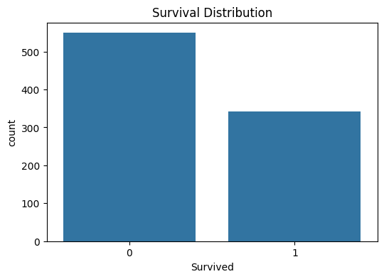
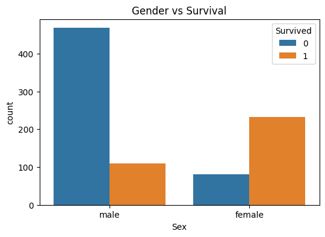
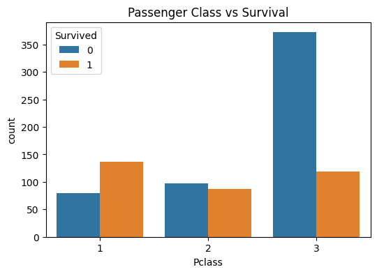
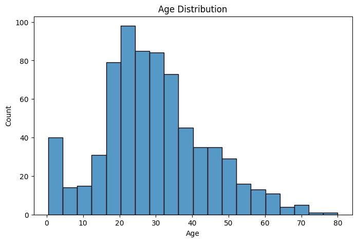
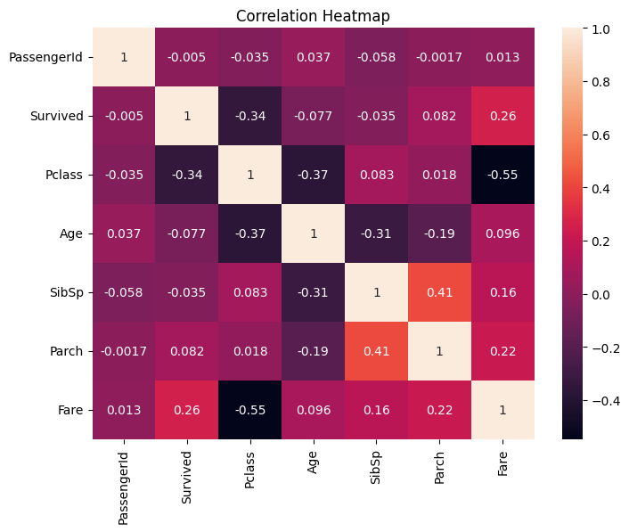

# PRODIGY_DS_02

## Objective
Perform Data Cleaning and Exploratory Data Analysis (EDA) on the Titanic Dataset.

## Dataset
Titanic Dataset

## Libraries Used
- Pandas
- NumPy
- Matplotlib
- Seaborn

## Tasks Performed
- Data Cleaning
- Missing Value Treatment
- Exploratory Data Analysis
- Correlation Analysis

## Key Findings
- Females had higher survival rates.
- First-class passengers survived more frequently.
- Most passengers were aged 20–40 years.

## Conclusion
EDA helped identify patterns and relationships among variables.

## Screenshots

### Visualization 1

### Visualization 2

### Visualization 3

### Visualization 4

### Visualization 5
